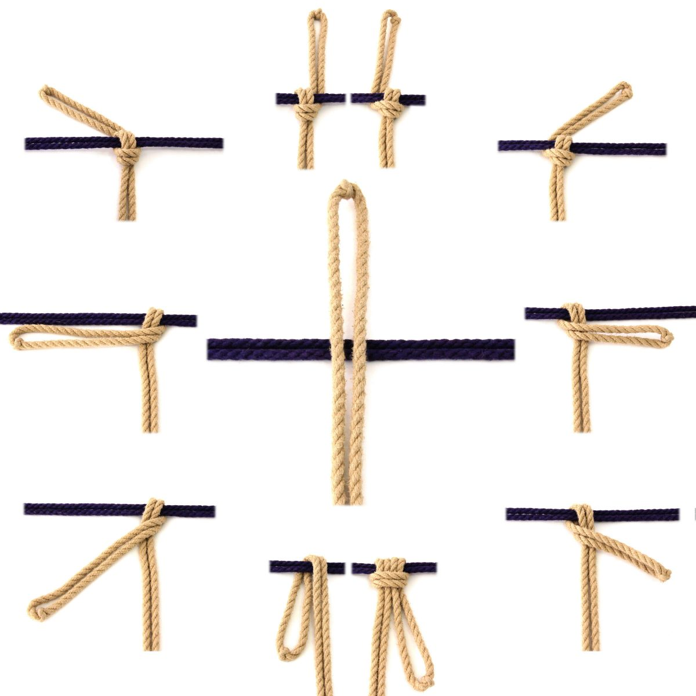

[Building Blocks – Junctions - TheDuchy](https://www.theduchy.com/building-blocks-junctions/#big-picture)

One very common activity when rigging is when deciding what to do  when two
ropes cross each other. Which direction do you want them to go as they move
away from the junction? This is something that you may  not have thought much
about if you’ve always been tying to a known  pattern, but when you start to
try to create on your own, understanding a few basic building blocks can be
extremely helpful.

Here are a few options when two ropes cross each other and how they are all
related…

When two rope cross each other you will either connect them or not  connect
them. If you connect them you have a few simple choices … and  they are all
related.
- If you are coming straight back down, you can just fold the rope over or use
  a **Cow Hitch**
- If you are going down and the left or right, you just use a **twist**
- If you are going straight up, **[Crossing Hitch (aka
  Nodome)](https://www.theduchy.com/crossing-hitch/)** (either-handed)
- If you are going up and to the Right, you use a **Right-handed Crossing
  Hitch**
- If you are going up and to the Left, you use a **Left-handed Crossing Hitch**
